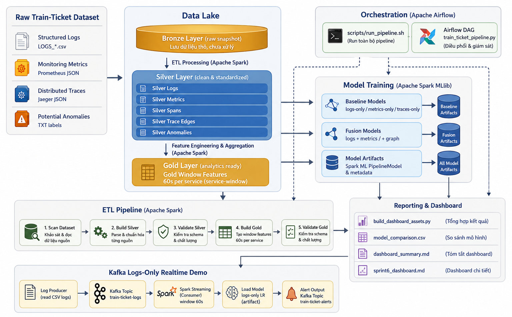
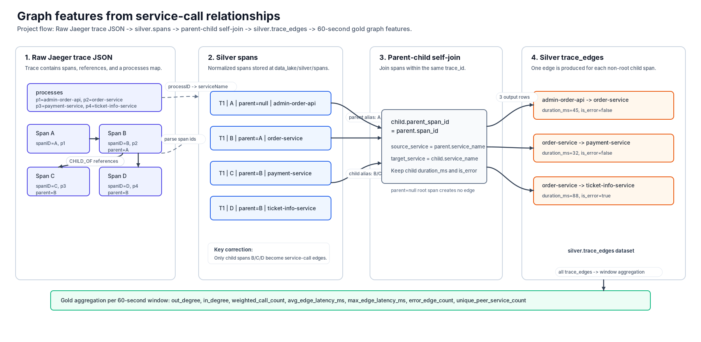
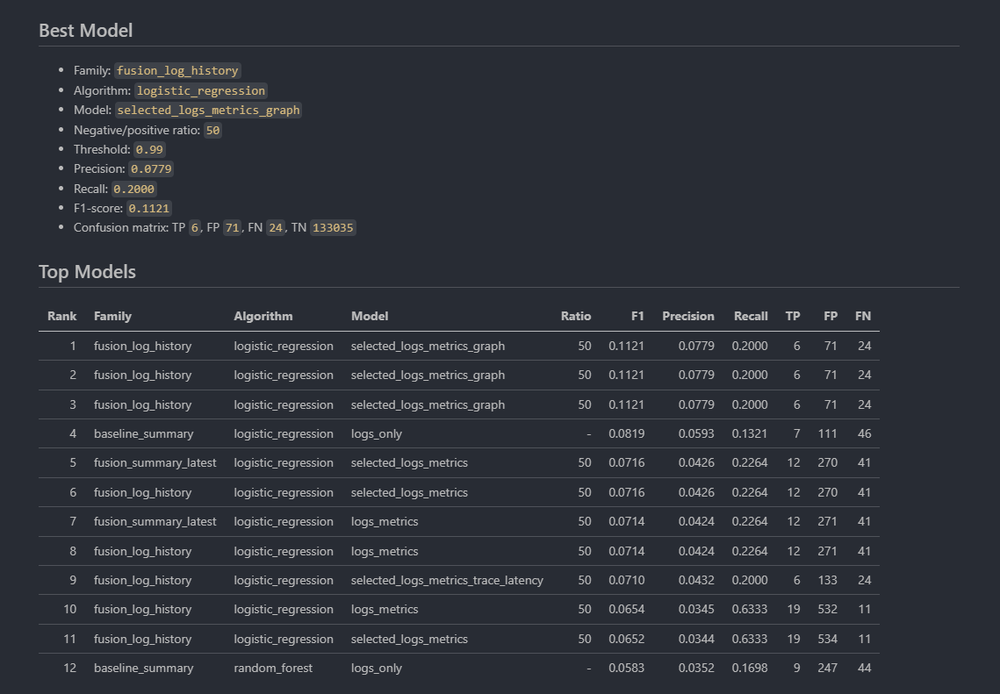
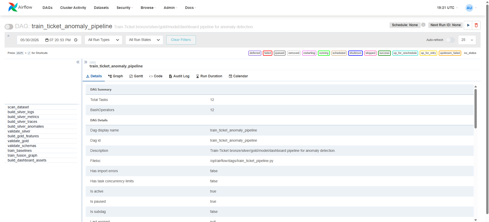
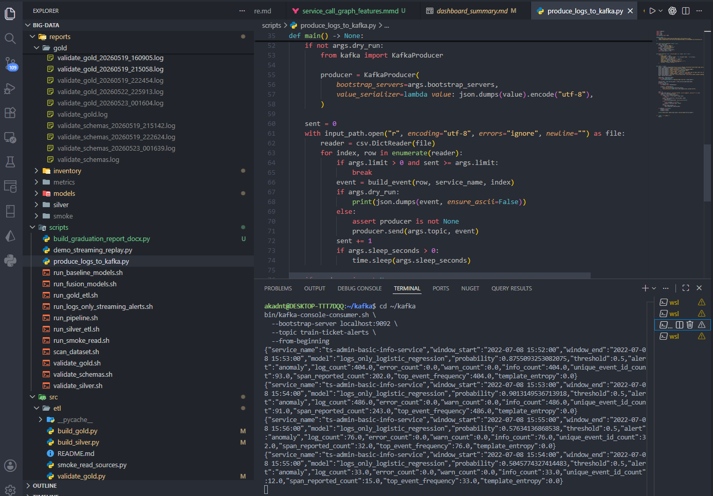

# Train-Ticket Telemetry Anomaly Platform


This project turns raw observability telemetry from the Train-Ticket microservice benchmark into a reproducible anomaly-detection platform. It implements a full bronze/silver/gold data lake, Apache Spark ETL jobs, schema validation, baseline and fusion ML pipelines, Airflow orchestration, dashboard-ready model comparisons, and a Kafka + Spark Structured Streaming realtime alert demo.

The repository is designed to be readable as both a working engineering system and a portfolio-grade reference architecture for telemetry analytics at scale.

<p align="center">
  
</p>

## Why This Project Stands Out

- **End-to-end Big Data architecture**: raw telemetry ingestion, data lake layering, feature engineering, model training, orchestration, and inference demo.
- **Multi-source observability fusion**: combines structured logs, Prometheus-style metrics, Jaeger traces, anomaly labels, and graph-derived service dependency features.
- **Production-inspired data contracts**: explicit silver/gold validation jobs, schema checks, CI compilation, and repeatable scripts.
- **Operational automation**: one-command pipeline plus an Airflow DAG with retries, timeouts, and task-level failure alerts.
- **Model artifact lifecycle**: trained Spark ML models are persisted and reused by the realtime streaming alert path.
- **Dashboard-first reporting**: generated CSV and Markdown summaries make model comparison easy to inspect, share, or plug into BI tools.

## Architecture

The platform follows a lakehouse-style flow:

1. **Bronze**: raw Train-Ticket telemetry is retained as the source snapshot.
2. **Silver**: Spark normalizes logs, metrics, spans, trace edges, and anomaly annotations.
3. **Gold**: telemetry is joined into 60-second service windows with machine-learning features.
4. **Modeling**: Spark MLlib trains single-source baselines and multi-source fusion models.
5. **Operations**: pipeline execution is automated by shell orchestration and Airflow.
6. **Realtime demo**: structured logs are replayed through Kafka and scored with a persisted model artifact.

```text
raw telemetry
  -> bronze landing
  -> silver logs / metrics / spans / trace_edges / anomalies
  -> gold service-window features
  -> baseline and fusion models
  -> dashboard assets and realtime alerts
```

## Data Sources

The Train-Ticket dataset represents a realistic microservice system with many interacting services. The pipeline processes four telemetry families:

| Source              | Format          | What It Contributes                                                  |
| ------------------- | --------------- | -------------------------------------------------------------------- |
| Structured logs     | CSV             | event templates, severity counts, span references, message frequency |
| Monitoring metrics  | JSON            | CPU, memory, network, node, and container-level signals              |
| Distributed traces  | Jaeger JSON     | spans, service latency, parent-child relationships, trace topology   |
| Potential anomalies | TXT annotations | weak labels for anomaly windows and affected service context         |

The normalized silver layer currently validates at the scale of millions of records, including logs, metrics, spans, and trace edges.

## Feature Engineering

Gold features are built at the `(service_name, window_start, window_end)` level with a default 60-second window. The feature set includes:

- **Log features**: event volume, severity counts, unique event templates, span-reported counts, dominant template frequency, template entropy.
- **Metric features**: CPU, memory, network, node memory, and CPU-rate aggregations.
- **Trace features**: span counts, duration statistics, error counts, and latency indicators.
- **Graph features**: in-degree, out-degree, weighted call count, edge latency, peer service count, and service-call error counts.
- **Labels**: anomaly windows generated from annotated incidents with a relaxed buffer for temporal alignment.

<p align="center">
  
</p>

## Machine Learning

The modeling layer compares single-source baselines against multi-source fusion approaches:

| Family                | Examples                                                                             |
| --------------------- | ------------------------------------------------------------------------------------ |
| Baseline models       | logs-only, metrics-only, traces-only                                                 |
| Fusion models         | logs + metrics, selected logs + metrics, trace-latency variants                      |
| Graph-enhanced models | selected logs + metrics + service-call graph features                                |
| Algorithms            | Logistic Regression, Random Forest, optional local experiments with XGBoost/LightGBM |

The current tracked dashboard summary identifies a graph-enhanced Logistic Regression configuration as the top F1 entry:

| Metric                  |                                 Value |
| ----------------------- | ------------------------------------: |
| Model                   |         `selected_logs_metrics_graph` |
| Negative/positive ratio |                                `50:1` |
| Tuned threshold         |                                `0.99` |
| Precision               |                              `0.0779` |
| Recall                  |                              `0.2000` |
| F1-score                |                              `0.1121` |
| Confusion matrix        | TP `6`, FP `71`, FN `24`, TN `133035` |

The dataset is heavily imbalanced, so the project emphasizes precision, recall, F1-score, threshold tuning, and confusion-matrix analysis instead of accuracy alone.

<p align="center">
  
</p>

## Project Layout

```text
.
├── airflow/                  # Airflow DAG for orchestration
├── architecture/             # Architecture notes and demos
├── configs/                  # Project configuration
├── data/                     # Raw local dataset location
├── data_lake/                # Bronze, silver, gold, and streaming checkpoint layers
├── notebooks/                # Dashboard and analysis notes
├── reports/                  # Generated metrics, model artifacts, dashboard outputs
├── scripts/                  # Reproducible command-line entrypoints
├── src/
│   ├── etl/                  # Spark ETL and validation jobs
│   ├── models/               # Baseline and fusion model training
│   ├── reports/              # Dashboard asset builder
│   └── streaming/            # Spark Structured Streaming alert job
└── tests/                    # Unit tests for dashboard asset generation
```

## Quickstart

Create a Python environment and install dependencies:

```bash
python -m venv .venv
source .venv/bin/activate
pip install -r requirements.txt
```

Run the lightweight end-to-end pipeline:

```bash
bash scripts/run_pipeline.sh
```

The pipeline performs dataset scanning, silver ETL, gold feature generation, validation, model training, and dashboard asset generation.

To skip expensive stages during iteration:

```bash
RUN_SILVER=0 RUN_GOLD=0 RUN_BASELINES=0 bash scripts/run_pipeline.sh
```

Regenerate dashboard assets from existing model outputs:

```bash
python src/reports/build_dashboard_assets.py
```

Run unit tests:

```bash
python -m unittest discover -s tests
```

## Pipeline Commands

Run individual stages when debugging or developing:

```bash
bash scripts/run_smoke_read.sh
bash scripts/run_silver_etl.sh all
bash scripts/validate_silver.sh
bash scripts/run_gold_etl.sh
bash scripts/validate_gold.sh
bash scripts/validate_schemas.sh
bash scripts/run_baseline_models.sh
bash scripts/run_fusion_models.sh
```

Train the default graph-enhanced fusion configuration:

```bash
bash scripts/run_fusion_models.sh reports/models \
  --algorithms logistic_regression \
  --feature-sets selected_logs_metrics_graph \
  --negative-positive-ratio 50
```

## Airflow Orchestration

The Airflow DAG coordinates the full workflow as a dependency graph:

```text
scan_dataset
  -> build_silver_logs / build_silver_metrics / build_silver_traces / build_silver_anomalies
  -> validate_silver
  -> build_gold_features
  -> validate_gold
  -> validate_schemas
  -> train_baselines / train_fusion_graph
  -> build_dashboard_assets
```

<p align="center">
  
</p>

Key operational controls:

| Variable                   | Purpose                                                           |
| -------------------------- | ----------------------------------------------------------------- |
| `TRAIN_TICKET_PROJECT_DIR` | Project root used by Airflow tasks                                |
| `SPARK_DRIVER_MEMORY`      | Spark driver memory, default `6g`                                 |
| `FUSION_ARGS`              | Feature set, algorithm, and sampling controls for fusion training |

## Realtime Streaming Demo

The realtime path demonstrates how a trained logs-only model artifact can be reused for near-real-time scoring:

1. A producer replays structured Train-Ticket logs into Kafka topic `train-ticket-logs`.
2. Spark Structured Streaming aggregates logs into 60-second feature windows.
3. The streaming job loads a persisted Spark ML model artifact.
4. Alert JSON events are emitted to Kafka topic `train-ticket-alerts`.

Run the demo with three terminals:

```bash
# Terminal 1: Spark streaming alert job
bash scripts/run_logs_only_streaming_alerts.sh \
  --threshold 0.5 \
  --output-mode kafka \
  --starting-offsets latest \
  --checkpoint-dir data_lake/checkpoints/logs_only_alerts_demo
```

```bash
# Terminal 2: consume alerts
bin/kafka-console-consumer.sh \
  --bootstrap-server localhost:9092 \
  --topic train-ticket-alerts \
  --from-beginning
```

```bash
# Terminal 3: replay logs
python scripts/produce_logs_to_kafka.py \
  --limit 2000 \
  --sleep-seconds 0.001
```

<p align="center">
  
</p>

## Data Quality And Reproducibility

The project includes multiple layers of verification:

- smoke reads for raw logs, metrics, and traces;
- silver-layer row and schema validation;
- gold feature validation;
- schema validation across silver and gold contracts;
- model metric snapshots and persisted Spark ML artifacts;
- dashboard asset tests;
- GitHub Actions CI for Python compilation and unit tests.

## Technology Stack

| Layer                  | Technology                                                     |
| ---------------------- | -------------------------------------------------------------- |
| Distributed processing | Apache Spark, PySpark, Spark SQL                               |
| ML training            | Spark MLlib, scikit-learn-compatible local experiments         |
| Orchestration          | Apache Airflow, shell pipeline                                 |
| Streaming              | Apache Kafka, Spark Structured Streaming                       |
| Storage format         | Local lakehouse layout, Parquet-oriented silver/gold outputs   |
| Reporting              | CSV, Markdown dashboard summaries, generated comparison assets |
| Quality                | Python unittest, schema validation scripts, GitHub Actions     |

## Roadmap

- Move from local filesystem storage to object storage or HDFS-compatible deployments.
- Add a production dashboard layer with Superset, Streamlit, or Grafana.
- Extend realtime inference from logs-only to multi-source streaming fusion.
- Add model registry metadata and model version promotion.
- Add richer PR-AUC/ROC-AUC tracking for imbalanced anomaly detection.
- Containerize Spark, Airflow, Kafka, and the pipeline entrypoints for one-command deployment.

## Contributing

Contributions are welcome. Good first areas include dashboard improvements, new feature families, additional validation checks, streaming hardening, and model experiment tracking.

Before opening a pull request:

```bash
python -m unittest discover -s tests
bash scripts/validate_schemas.sh
```

## License

No license has been declared yet. Add one before distributing, publishing, or reusing this project outside its current context.
